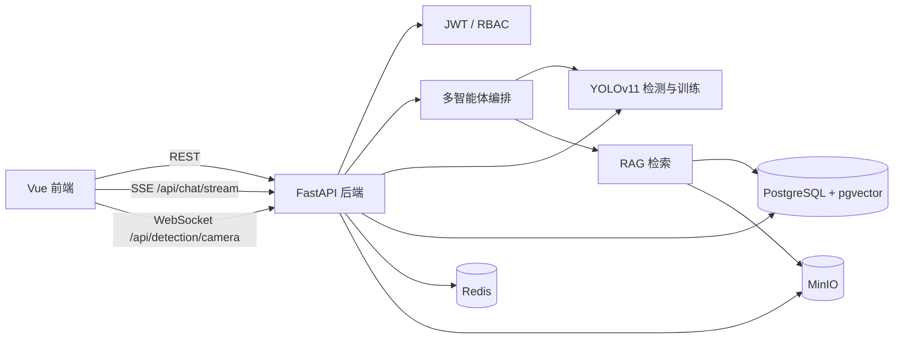

# AgriAgent-Disease-System

基于多智能体协同的果蔬病害检测与智能防治系统。

本项目是在老师提供的 “基于 YOLOv11 的目标检测智能体平台” Day01-Day12 基础项目上继续扩展的业务系统。课程文档主要保留为学习和验收参考，当前实际运行代码以 `backend/`、`frontend/`、`datasets/plant_disease/`、`backend/knowledge_base/`、`backend/models/` 为主。

## 项目定位

AgriAgent-Disease-System 面向果蔬和农作物叶片病害识别场景，提供从图片、批量图片、ZIP、视频、摄像头实时流到智能问答、知识库检索、检测历史、严重程度评估、天气风险分析、模型训练和管理员审核的一体化流程。

系统不是单纯的 YOLO 推理演示，而是把检测结果、知识库、对话记忆、用户权限、历史报告和模型版本管理串成一个可演示、可扩展的业务平台。

核心能力：

- 果蔬病害 YOLOv11 检测：单图、批量图片、ZIP、视频、实时摄像头。
- 多智能体对话：Supervisor 路由到检测 Agent、知识问答 Agent、数据分析 Agent。
- RAG 知识库：内置病害知识文档，支持用户投稿、管理员审核、向量化检索。
- 检测历史闭环：保存原图、标注图、类别、置信度、位置、天气风险、治疗状态和报告。
- 数据分析看板：病害分布、检测趋势、高频病害、模型表现等统计。
- 模型训练管理：启动训练、查看指标、评估、导出、下载和设为默认模型。
- 用户与权限：注册登录、JWT 鉴权、管理员和普通用户角色、账号禁用/启用。
- 中英文界面：前端文案和后端检测类别显示支持 `zh/en`。

## 技术栈

| 层级 | 技术 |
| --- | --- |
| 前端 | Vue 3、Vite、Pinia、Vue Router、Element Plus、ECharts、SCSS、Vitest |
| 后端 | FastAPI、SQLAlchemy、Alembic、Pydantic、pytest |
| AI / Agent | LangChain、LangGraph、DashScope / Qwen 兼容接口、OpenAI 兼容客户端 |
| 检测与训练 | Ultralytics YOLOv11、OpenCV、Pillow、ByteTrack |
| 数据与存储 | PostgreSQL + pgvector、Redis、MinIO |
| 通信 | REST API、SSE 流式对话、WebSocket 摄像头检测 |
| 运维 | Docker Compose、Uvicorn、Alembic 迁移 |

## 系统架构



## 目录说明

```text
.
├── backend/                         # FastAPI 后端
│   ├── app/
│   │   ├── agent/                   # 多智能体、工具、记忆、提示词
│   │   ├── api/                     # REST / SSE / WebSocket API
│   │   ├── config/                  # 全局配置和检测配置
│   │   ├── core/                    # 日志、安全、异常、语言工具
│   │   ├── database/                # SQLAlchemy 会话
│   │   ├── entity/                  # ORM 模型和 Pydantic Schema
│   │   ├── middleware/              # 限流、日志、探活中间件
│   │   ├── rag/                     # 文档加载、Embedding、Retriever
│   │   ├── services/                # 检测、历史、数据集、用户等业务服务
│   │   ├── storage/                 # Redis 和 MinIO 客户端
│   │   ├── training/                # YOLO 训练服务
│   │   └── vectorstore/             # pgvector 访问
│   ├── alembic/                     # 数据库迁移
│   ├── knowledge_base/              # 内置病害知识 Markdown
│   ├── models/                      # 预训练和导出的模型版本
│   ├── runs/train/                  # 训练产物
│   ├── tests/                       # 后端自动化测试
│   └── tools/                       # 初始化、导入、评估辅助脚本
├── frontend/                        # Vue 前端
│   ├── src/api/                     # API 封装
│   ├── src/components/              # 通用组件和业务组件
│   ├── src/stores/                  # Pinia 状态
│   ├── src/utils/                   # request、SSE、WebSocket、i18n
│   ├── src/views/                   # 页面
│   └── tests/                       # 前端测试
├── datasets/plant_disease/          # 植物病害 YOLO 数据集
├── docs/                            # Day12 部署文档
├── 3. Day01...md - 13. Day11...md   # 老师基础项目教程文档
├── 开发记录.md                       # 团队后端/整体开发记录
├── 前端开发记录.md                   # 前端架构和开发记录
├── 开发协作规范.md                   # Git 协作规范
├── docker-compose.yml               # PostgreSQL、Redis、MinIO
└── package.json                     # 根目录一键开发脚本
```

## 核心功能

### 1. 用户与权限

- 用户注册、用户名或邮箱登录。
- JWT 鉴权，前端自动携带 `Authorization: Bearer <token>`。
- 用户资料、密码修改、忘记密码验证码流程。
- `admin` 和 `user` 两类角色。
- 管理员可查看、创建、修改、禁用、启用用户。
- 管理员页面和训练页面前端路由要求管理员权限。

默认初始化脚本会创建：

```text
用户名：admin
密码：admin123
邮箱：admin@example.com
角色：admin
```

首次部署后应立即修改默认管理员密码。

### 2. 快捷检测

快捷检测绕过大模型，直接调用 YOLO 服务：

- 单图检测：`POST /api/detection/single`
- 批量图片检测：`POST /api/detection/batch`
- ZIP 检测：`POST /api/detection/zip`
- 视频检测：`POST /api/detection/video`
- 视频进度轮询：`GET /api/detection/video/status/{task_id}`
- 摄像头实时检测：`WebSocket /api/detection/camera`

检测结果包含：

- `total_objects`
- `class_counts`
- `class_counts_display`
- `detections`
- `annotated_image_base64`
- `annotated_image_url`
- `inference_time`
- `task_id`

图片支持 `.jpg`、`.jpeg`、`.png`、`.bmp`、`.webp`。视频支持 `.mp4`、`.avi`、`.mov`、`.mkv`、`.wmv`、`.flv`，单个视频限制为 50MB。

### 3. 多智能体对话

前端通过 `POST /api/chat/stream` 使用 SSE 获取流式回复。后端使用 Supervisor 进行意图路由，并调用不同 Agent：

- 检测 Agent：处理图片、批量图片、ZIP、视频检测需求。
- 知识问答 Agent：从病害知识库检索并生成回答。
- 数据分析 Agent：查询历史检测统计、用户数据和趋势。
- 通用对话：无明确工具调用时提供普通答复。

对话支持会话持久化：

- `GET /api/chat/sessions`
- `POST /api/chat/sessions`
- `GET /api/chat/sessions/{session_id}`
- `PATCH /api/chat/sessions/{session_id}`
- `DELETE /api/chat/sessions/{session_id}`
- `POST /api/chat/clear`

附件先通过 `POST /api/chat/upload` 上传到临时目录，图片和视频会尽量同步到 MinIO，保证刷新后仍能展示。

### 4. RAG 知识库

内置知识库目录：`backend/knowledge_base/`。

当前包含：

- YOLO 目标检测基础知识
- 视频检测与唯一目标计数
- 植物病害检测类别说明
- 项目涉及的植物病虫害知识
- 植物病害识别后的处置建议
- 目标检测评估指标与训练曲线解读
- 植物病害检测平台使用与结果说明

普通用户可以投稿 `.md` 或 `.txt` 文档，文档先进入待审核状态。管理员审核通过后，系统会读取 MinIO 中的原文，分块、生成 Embedding，并写入 pgvector。Agent 问答只检索已发布文档。

主要接口：

- `POST /api/knowledge/documents`
- `POST /api/knowledge/documents/batch`
- `GET /api/knowledge/documents`
- `GET /api/knowledge/my-submissions`
- `POST /api/knowledge/search`
- `GET /api/knowledge/admin/documents`
- `GET /api/knowledge/admin/pending`
- `PUT /api/knowledge/admin/{document_id}/approve`
- `PUT /api/knowledge/admin/{document_id}/reject`
- `DELETE /api/knowledge/admin/{document_id}`
- `POST /api/knowledge/build`
- `GET /api/knowledge/stats`

### 5. 历史记录、风险评估与报告

检测任务会落库为 `DetectionTask` 和 `DetectionResult`。历史页支持：

- 任务分页、筛选、详情查看。
- 原图、标注图、视频关键帧和统计结果展示。
- 病害严重程度问卷。
- 治疗状态记录。
- 位置授权后刷新天气环境风险。
- HTML / PDF 报告预览与下载。
- “询问 AI” 将历史任务上下文带入 Agent 对话。

主要接口：

- `GET /api/history/tasks`
- `GET /api/history/tasks/{task_id}`
- `GET /api/history/severity-questions`
- `POST /api/history/tasks/{task_id}/severity-assessment`
- `PATCH /api/history/tasks/{task_id}/treatment-status`
- `PATCH /api/history/tasks/{task_id}/location`
- `GET /api/history/tasks/{task_id}/weather-risk`
- `GET /api/history/tasks/{task_id}/report`
- `GET /api/history/tasks/{task_id}/report/download`
- `GET /api/history/summary`
- `GET /api/history/scenes`

### 6. 数据分析看板

看板和分析页围绕当前用户或管理员可访问的数据生成统计：

- 总检测次数、图片数、目标数、平均推理耗时。
- 病害类别分布。
- 检测趋势。
- 模型性能。
- 高频病害 Top 列表。
- 场景、任务类型等维度分布。

主要接口：

- `GET /api/dashboard/statistics`
- `GET /api/dashboard/trend`
- `GET /api/dashboard/class-dist`
- `GET /api/dashboard/scene-dist`
- `GET /api/dashboard/type-dist`
- `GET /api/analytics/summary`
- `GET /api/analytics/disease-distribution`
- `GET /api/analytics/detection-trend`
- `GET /api/analytics/model-performance`
- `GET /api/analytics/top-diseases`

### 7. 数据集与模型训练

数据集管理支持：

- 创建数据集。
- 上传图片、标签、ZIP。
- YOLO 格式解析。
- 数据集统计、划分、导出。
- 病害类别列表查询。

模型训练支持：

- 启动 YOLO 训练任务。
- 后台线程执行训练。
- 实时记录 epoch 指标。
- 查询任务状态和训练曲线。
- 停止训练。
- 模型评估。
- 导出正式模型版本。
- 下载权重。
- 使用指定训练任务模型做预测。

训练和管理类接口需要管理员权限。

## 数据集与模型

当前仓库包含 `datasets/plant_disease/data.yaml`，类别数为 30，数据划分为：

| 划分 | 图片数量 |
| --- | ---: |
| train | 9976 |
| val | 759 |
| test | 763 |

主要类别覆盖苹果、甜椒、玉米、葡萄、马铃薯、南瓜、番茄等作物的健康叶片和常见病害。中文类别映射写在 `data.yaml` 的 `names_cn` 中，后端也会结合检测场景配置生成中文或英文显示名。

当前已导出的模型版本：

```text
目录：backend/models/plant_disease_v1.0.0
权重：backend/models/plant_disease_v1.0.0/best.pt
版本：v1.0.0
模型名：plant_disease_best
场景：plant_disease
训练轮数：80
输入尺寸：640
batch_size：16
优化器：SGD
```

评估指标来自 `backend/models/plant_disease_v1.0.0/eval_report.json`：

| 指标 | 数值 |
| --- | ---: |
| Precision | 0.70802 |
| Recall | 0.65808 |
| mAP50 | 0.69474 |
| mAP50-95 | 0.53148 |

## 本地运行

以下命令以 Windows PowerShell 为例。项目根目录是 `E:\rsod-agent-platform`。

### 1. 准备基础环境

建议版本：

- Python 3.10+
- Node.js 18+
- Docker Desktop
- Git
- 可选：NVIDIA CUDA GPU
- 可选：`ffmpeg`，用于视频转码为浏览器更稳定播放的 H.264 MP4

### 2. 启动基础服务

```powershell
docker compose up -d
```

服务端口：

| 服务 | 地址 |
| --- | --- |
| PostgreSQL | `localhost:5432` |
| Redis | `localhost:6379` |
| MinIO API | `http://localhost:9000` |
| MinIO Console | `http://localhost:9001` |

MinIO 默认账号密码：

```text
minioadmin / minioadmin
```

### 3. 安装后端依赖

```powershell
cd backend
python -m venv .venv
.\.venv\Scripts\activate
pip install -r requirements.txt
```

### 4. 配置后端环境变量

```powershell
cd backend
Copy-Item .env.example .env
```

开发环境最少需要确认这些配置：

```env
DB_HOST=localhost
DB_PORT=5432
DB_NAME=rsod_agent
DB_USER=rsod_admin
DB_PASSWORD=rsod_admin

REDIS_HOST=localhost
REDIS_PORT=6379

MINIO_ENDPOINT=localhost:9000
MINIO_ACCESS_KEY=minioadmin
MINIO_SECRET_KEY=minioadmin
MINIO_BUCKET=rsod-agent-images
MINIO_SECURE=false

JWT_SECRET_KEY=please-change-this-in-real-deployment
ALLOWED_ORIGINS=http://localhost:5173,http://localhost:3000,http://localhost:8080
```

Agent 和 RAG 需要大模型和 Embedding 配置。未配置时，基础检测、用户、历史等确定性功能仍可使用，但智能问答和知识检索会受限。

```env
QWEN_API_KEY=sk-...
QWEN_BASE_URL=https://dashscope.aliyuncs.com/compatible-mode/v1
QWEN_MODEL=qwen3.7-max-preview

QWEN_EMBEDDING_API_KEY=sk-...
EMBEDDING_MODEL=text-embedding-v3
```

忘记密码邮件功能需要 SMTP：

```env
SMTP_HOST=smtp.qq.com
SMTP_PORT=465
SMTP_USER=your-email@qq.com
SMTP_PASSWORD=your-smtp-auth-code
SMTP_FROM_NAME=农作物病害检测系统
```

### 5. 初始化数据库

```powershell
cd backend
.\.venv\Scripts\activate
alembic upgrade head
python tools\init_roles.py
python tools\import_existing_model.py
```

如需初始化 RAG 内置知识库，确保 PostgreSQL、pgvector、MinIO、Qwen Embedding 配置可用后执行：

```powershell
python tools\import_knowledge_base_documents.py
```

### 6. 安装前端依赖

```powershell
cd frontend
npm install
Copy-Item .env.example .env
```

前端环境变量：

```env
VITE_API_BASE_URL=http://localhost:8000
VITE_APP_TITLE=RSOD Agent Platform
VITE_MINIO_URL=http://localhost:9000
```

### 7. 启动开发环境

可以在根目录一键启动 Docker 依赖、后端和前端：

```powershell
npm install
npm run dev
```

也可以分开启动：

```powershell
# 终端 1：后端
cd backend
.\.venv\Scripts\activate
python -m uvicorn main:app --reload --host 0.0.0.0 --port 8000

# 终端 2：前端
cd frontend
npm run dev
```

访问地址：

| 应用 | 地址 |
| --- | --- |
| 前端 | `http://localhost:5173` |
| 后端 API | `http://localhost:8000` |
| Swagger | `http://localhost:8000/docs` |
| ReDoc | `http://localhost:8000/redoc` |

## 前端页面

| 路由 | 页面 | 权限 | 说明 |
| --- | --- | --- | --- |
| `/` | WebPage | 公开 | 项目介绍和入口 |
| `/login` | LoginPage | 公开 | 登录 |
| `/register` | LoginPage | 公开 | 注册模式 |
| `/home` | HomePage | 登录 | 首页自然语言入口、天气、快捷入口 |
| `/ai-chat` | ChatPage | 登录 | Agent 对话、附件检测、实时检测入口 |
| `/data-analysis` | AnalyticsPage | 登录 | 统计分析和图表 |
| `/history` | HistoryPage | 登录 | 检测历史、详情、报告、风险 |
| `/knowledge` | KnowledgeContributionPage | 登录 | 知识投稿和已发布文档 |
| `/admin` | AdminPage | 管理员 | 用户管理、知识审核 |
| `/training` | TrainingPage | 管理员 | 模型训练、评估、导出 |

## 主要 API 分组

| 分组 | 前缀 | 说明 |
| --- | --- | --- |
| 认证 | `/api/auth` | 注册、登录、资料、密码、语言偏好 |
| 智能对话 | `/api/chat` | 附件上传、SSE 对话、会话管理 |
| 快捷检测 | `/api/detection` | 单图、批量、ZIP、视频、摄像头 |
| 数据集 | `/api/dataset` | 数据集创建、上传、转换、统计、导出 |
| 训练 | `/api/training` | 训练任务、指标、评估、导出、下载、预测 |
| 用户管理 | `/api/user` | 管理员用户列表、创建、修改、禁用、启用 |
| 看板 | `/api/dashboard` | 汇总统计、趋势、类别、场景、类型 |
| 历史 | `/api/history` | 任务列表、详情、风险、报告、治疗状态 |
| 分析 | `/api/analytics` | 病害分布、趋势、模型表现、高频病害 |
| 知识库 | `/api/knowledge` | 投稿、审核、检索、索引构建、统计 |
| 健康检查 | `/api/health` | 服务、Redis 和详细状态 |

完整参数以 `http://localhost:8000/docs` 为准。

## 测试与构建

后端测试：

```powershell
cd backend
.\.venv\Scripts\activate
pytest
```

前端测试：

```powershell
cd frontend
npm run test:run
```

前端生产构建：

```powershell
cd frontend
npm run build
```

根目录也提供了：

```powershell
npm run services:up
npm run services:down
npm run dev:backend
npm run dev:frontend
```
