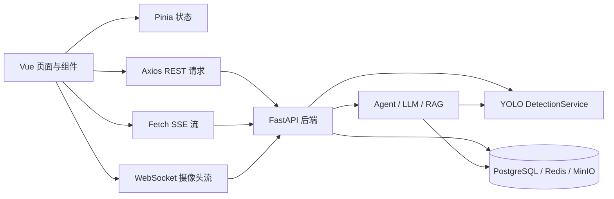

# AgriAgent-Disease-System 前端开发记录

> 文档用途：记录前端架构、开发进度、接口联调、问题处理。  
> 建立日期：2026-07-10  
> 当前分支：`frontend-lucy`  
> 更新规则：后续修改按日期追加到“开发日志”，不要删除已经完成的记录。

---

## 1. 项目目标

AgriAgent-Disease-System 是一个面向果蔬病害诊断的智能应用。前端不仅负责普通页面展示，还负责组织三类不同的数据交互：

1. **确定性检测**：图片、批量图片、ZIP、视频和实时摄像头直接调用 YOLO 检测接口。
2. **Agent 对话**：自然语言通过 SSE 流式接口发送给 Agent，由大模型决定是否调用检测、知识库或数据分析工具。
3. **业务数据展示**：展示登录用户的检测历史、统计数据、训练任务和对话记录。

当前前端的主要设计方向是：以自然语言交互为核心，同时保留不依赖大模型的快捷检测通道，确保 LLM 不可用时基础检测仍可使用。

---

## 2. 当前技术栈

| 分类 | 技术 | 作用 |
| --- | --- | --- |
| 前端框架 | Vue 3 + Composition API | 页面和组件开发 |
| 构建工具 | Vite 8 | 开发服务器与生产构建 |
| 状态管理 | Pinia | 用户、语言、会话和消息状态 |
| UI 组件 | Element Plus | 表单、弹窗、表格、分页、消息提示 |
| 路由 | Vue Router | 登录守卫与页面导航 |
| HTTP | Axios | 普通 REST API 请求 |
| 流式通信 | Fetch + ReadableStream | Agent SSE 对话 |
| 实时通信 | WebSocket | 摄像头逐帧实时检测 |
| 图表 | ECharts + vue-echarts | Analytics 和训练指标 |
| 文本渲染 | markdown-it | 大模型 Markdown 回复 |
| 样式 | SCSS + scoped CSS | 全局变量与组件局部样式 |
| 测试 | Vitest + Vue Test Utils | 前端自动化测试基础 |

---

## 3. 前端总体架构



### 3.1 普通 REST 请求

统一封装在 `frontend/src/utils/request.js`：

- `baseURL` 为 `/api`，开发环境由 Vite Proxy 转发到后端。
- 自动加入 `Authorization: Bearer <token>`。
- 自动加入 `X-Display-Language: zh/en`。
- FormData 请求自动移除固定 JSON Content-Type，让浏览器生成 multipart boundary。
- 对 401、403、404、422、500 和网络异常进行统一提示。

### 3.2 SSE 流式请求

统一封装在 `frontend/src/utils/stream.js`：

- 使用 `fetch()` 发起 `POST /api/chat/stream`。
- 通过 `ReadableStream` 持续读取 SSE 数据。
- 使用空行切分 SSE 消息，保留不完整缓冲区。
- 支持 `[DONE]` 结束标志。
- 使用 `AbortController` 支持用户中断生成。
- SSE 不经过 Axios，因此单独加入 Token 和语言请求头。

### 3.3 WebSocket 实时检测

统一封装在 `frontend/src/utils/cameraWs.js`：

- 根据当前网页协议自动选择 `ws://` 或 `wss://`。
- 连接 `/api/detection/camera`。
- 发送检测配置：推理模式、置信度、IoU、场景和语言。
- 从摄像头 Canvas 抽取 JPEG Base64 帧并持续发送。
- 接收标注帧、目标列表、FPS、推理耗时和帧数。
- 页面离开或停止检测时主动释放 WebSocket 和摄像头资源。

---

## 4. 目录职责

```text
frontend/src/
├── api/                     # REST API 封装
│   ├── auth.js              # 登录、注册、用户信息和语言偏好
│   ├── common.js            # Agent 对话附件上传
│   ├── detection.js         # 单图、批量、ZIP、视频检测
│   ├── history.js           # 历史任务、摘要、详情、场景和删除
│   ├── knowledge.js         # RAG 知识库索引重建
│   └── weather.js           # 首页天气接口预留
├── components/
│   ├── ChatComposer.vue     # 对话输入、附件菜单、拍照和语音入口
│   ├── ChatMessageList.vue  # 对话消息渲染
│   ├── ChatSidebar.vue      # 最近会话与页面导航
│   ├── DiagnosisCard.vue    # 快捷 YOLO 诊断卡片
│   ├── AgentResultCard.vue  # YOLO 结果 + LLM 分析卡片
│   ├── DetectionResultCard.vue
│   ├── VideoDetectionProgressCard.vue
│   ├── RealtimeDetectionCard.vue
│   ├── LanguageSwitcher.vue
│   ├── WeatherBadge.vue
│   ├── history/             # HistoryPage 拆分组件
│   └── layout/              # 通用 Header / Sidebar / MainLayout
├── stores/
│   ├── user.js              # Token、用户信息和角色
│   ├── agent.js             # 会话、消息、首页待发送问题和 SSE 状态
│   └── locale.js            # 中英文状态和后端偏好同步
├── utils/
│   ├── request.js           # Axios 封装
│   ├── stream.js            # SSE 解析
│   ├── cameraWs.js          # WebSocket 封装
│   ├── i18n.js              # 中英文固定文案
│   ├── markdown.js          # LLM 回复格式化
│   └── errorReporter.js     # 前端错误捕获
└── views/                   # 路由页面
```

---

## 5. 页面开发进度

| 页面 | 当前状态 | 已实现内容 | 后续工作 |
| --- | --- | --- | --- |
| LoginPage | --- | ---  | 登录页面的设计，布局，跳转路由等，可补充忘记密码入口 |
| RegisterPage |  --- | ---  | 根据Login的形式完成 |
| HomePage | 已完成主要交互 | 自然语言首页、附件菜单、建议问题、用户卡片、天气占位/接口 | 天气正式后端接口联调 |
| ChatPage | 核心功能已完成 | 普通对话、SSE、会话历史、快捷检测、Agent 图片、视频、拍照、实时检测 | 继续统一错误文案和移动端细节 |
| HistoryPage | 已实现，待真实数据验收 | 摘要、筛选、分页、时间线、详情、标注图、删除、询问 AI | 后端增加 keyword、severity、treatment 后再扩展 ，实现按照作物严重程度等的filter|
| AnalyticsPage | 已接入统计接口 | 摘要、病害分布、趋势、模型性能和高频病害图表 | 核对所有统计口径和空状态 |
| TrainingPage | 保留并可访问 | 任务列表、状态、指标、评估、导出、下载和测试预测 | 训练权限和管理员逻辑由后端完善 |
| DetectionPage | 工程文件保留 | 独立实时检测页面 | 当前主要入口已迁移到 ChatPage 组件 |

---

## 6. 核心业务流程

### 6.1 登录与鉴权

```text
LoginPage
  → POST /api/auth/login
  → 保存 rsod_token 和 rsod_user
  → Router Guard 检查 Token
  → Axios 自动携带 Authorization
```

用户退出后清除本地 Token、用户信息和 Agent 状态。401 响应会自动跳转登录页。

### 6.2 首页自然语言入口

首页不是独立聊天后端，而是对 ChatPage 的轻量入口：

```text
首页输入文字或选择附件
  → agentStore.queueHomePrompt()
  → 跳转 /ai-chat
  → ChatPage.consumePendingPrompt()
  → 自动进入对应发送流程
```

这样首页保持简洁，同时避免维护两套聊天逻辑。

### 6.3 快捷 YOLO 检测通道

用于明确知道要检测图片、希望立即得到确定性结果的场景。

```text
选择单图 / 批量 / ZIP
  → FormData 上传到 Detection API
  → YOLO 直接推理（不经过 LLM）
  → DiagnosisCard / DetectionResultCard 展示结果
  → 保存到当前对话和检测历史
```

接口：

- `POST /api/detection/single`
- `POST /api/detection/batch`
- `POST /api/detection/zip`
- `GET /api/detection/status/{task_id}`

优势：速度快、结果稳定，并可作为 LLM 故障时的降级通道。

### 6.4 图片 + 自然语言 Agent 通道

```text
先上传图片到 /api/chat/upload
  → 输入问题
  → POST /api/chat/stream
  → Agent 决定调用 detect_single_image / detect_batch_images
  → YOLO 结果先渲染
  → LLM 分析文本继续流式追加
```

交互规则：

- 图片上传后先停留在输入栏，用户可以继续输入问题。
- 没有额外问题时，可使用快捷检测获得 YOLO 结果。
- 有文字问题时，图片路径和自然语言一起发送给 Agent。
- YOLO 通常比 LLM 快，因此检测卡片先显示，大模型区域显示“正在分析”。
- LLM 分析的是 YOLO 结构化结果，当前并不是把原始图片直接传给视觉大模型。

### 6.5 视频检测

```text
选择视频
  → POST /api/detection/video
  → 后端返回 task_id
  → GET /api/detection/video/status/{task_id} 轮询
  → 完成后播放 annotated_video_url
  → 视频不可播放时显示关键帧
```

视频卡片显示时长、FPS、总帧、处理帧、目标数、类别统计和推理耗时。浏览器播放失败时会根据错误类型给出提示，并降级到关键帧预览。

### 6.6 实时摄像头检测

实时检测已作为 `RealtimeDetectionCard.vue` 嵌入 ChatPage，不再要求用户进入独立 DetectionPage。

```text
点击实时检测
  → 浏览器请求摄像头权限
  → 建立 WebSocket
  → 定时发送压缩视频帧
  → 接收标注帧和 detections
  → 卡片内更新 FPS、推理耗时、目标数和类别累计
```

为避免类别变化导致按钮跳动，卡片主要控制区域使用稳定布局和固定尺寸。

### 6.7 对话历史

`agentStore` 管理最近会话：

- 加载会话列表。
- 创建新会话。
- 加载指定会话消息。
- 重命名、删除和清空会话。
- 从 `tool_result` 恢复历史检测卡片。
- 从持久化附件 URL 恢复用户上传的图片和视频。

接口：

- `GET /api/chat/sessions`
- `POST /api/chat/sessions`
- `GET /api/chat/sessions/{session_id}`
- `PATCH /api/chat/sessions/{session_id}`
- `DELETE /api/chat/sessions/{session_id}`
- `POST /api/chat/sessions/{session_id}/quick-detection`

### 6.8 检测历史 HistoryPage

HistoryPage 以 `figma-design/src/app/pages/History.tsx` 为视觉参考，已改造成真实后端数据页面。

页面结构：

- 总任务、今日任务、已完成、处理中/待处理摘要。
- 类型、状态、场景、日期筛选。
- 按日期分组的时间线任务卡片。
- 任务详情弹窗：类别统计、置信度、推理耗时、标注图和目标明细。
- 删除任务。
- 将任务概要转为自然语言问题并跳转 ChatPage 询问 AI。

接口：

- `GET /api/history/summary`
- `GET /api/history/tasks`
- `GET /api/history/tasks/{task_id}`
- `DELETE /api/history/tasks/{task_id}`
- `GET /api/history/scenes`

当前 `keyword` 只在 API 层声明，服务层没有参与数据库查询，因此前端暂时只搜索当前页。后端尚未返回严重程度和治疗状态，页面使用“让 AI 分析”的明确占位，不伪造业务数据。

### 6.9 RAG 与数据工具

前端不直接处理向量检索。RAG 由 Agent 后端完成：

```text
用户提问病害知识
  → Agent 调用 search_knowledge
  → pgvector 检索知识片段
  → LLM 根据片段回答并列出来源
```

知识库管理接口：

- `POST /api/knowledge/build?force_rebuild=true`
- `GET /api/knowledge/stats`
- `POST /api/knowledge/search`

Agent 还可以调用 `query_detection_stats` 和 `query_detection_history` 查询当前登录用户的数据。需要区分：RAG 用于专业文档知识，历史查询工具用于数据库业务数据。

---

## 7. API 对接总表

| 功能 | 前端入口 | 后端接口 | 通信方式 |
| --- | --- | --- | --- |
| 登录 | LoginPage | `POST /api/auth/login` | Axios |
| 注册 | RegisterPage | `POST /api/auth/register` | Axios |
| 用户信息 | HomePage/Header | `GET /api/auth/me`、`GET /api/auth/profile` | Axios |
| 语言偏好 | LanguageSwitcher | `PUT /api/auth/preferences` | Axios |
| 对话附件上传 | ChatComposer | `POST /api/chat/upload` | Axios + FormData |
| Agent 对话 | ChatPage | `POST /api/chat/stream` | Fetch SSE |
| 会话历史 | ChatSidebar | `/api/chat/sessions*` | Axios |
| 单图检测 | ChatComposer | `POST /api/detection/single` | Axios + FormData |
| 批量检测 | ChatComposer | `POST /api/detection/batch` | Axios + FormData |
| ZIP 检测 | ChatComposer | `POST /api/detection/zip` | Axios + FormData |
| 视频检测 | ChatComposer | `POST /api/detection/video` | Axios + FormData |
| 视频进度 | VideoCard | `GET /api/detection/video/status/{id}` | Axios 轮询 |
| 实时检测 | RealtimeCard | `/api/detection/camera` | WebSocket |
| 检测历史 | HistoryPage | `/api/history/*` | Axios |
| 数据分析 | AnalyticsPage | `/api/analytics/*` | Axios |
| 训练任务 | TrainingPage | `/api/training/*` | Axios |
| RAG 建库 | knowledge.js | `/api/knowledge/build` | Axios |

---

## 8. 中英文切换设计

语言状态由 `stores/locale.js` 管理：

1. 首次默认中文。
2. 从 `localStorage.rsod_locale` 恢复语言。
3. 切换时调用后端保存用户偏好。
4. Axios 请求自动发送 `X-Display-Language`。
5. SSE 手动发送 `X-Display-Language`。
6. WebSocket 通过查询参数和 config 消息传递语言。

后端负责随语言变化的内容：检测类别显示名、标注图类别、摄像头检测结果和新的 Agent 回复。前端负责按钮、导航、状态、提示和卡片固定文案。

历史消息不会因为切换语言而重新翻译，这是持久化内容的正常行为。

---

## 9. 已处理的重要问题

### 9.1 图片上传后立即发送，无法补充文字

处理方式：将“上传完成”和“发送消息”拆成两个阶段。文件先进入输入栏队列，用户可以继续输入文字，再触发 Agent 发送。

### 9.2 拍照必须先点击输入框才能发送

处理方式：拍照结果直接进入统一上传队列，并由队列状态控制发送按钮，不再依赖输入框的 focus/input 事件。

### 9.3 历史会话重新打开后原图消失

原因：Blob URL 只在当前浏览器会话有效。  
处理方式：上传时将附件写入 MinIO，消息历史保存持久化 URL；重新加载会话时从 `tool_result.attachments` 恢复。

### 9.4 历史视频重新打开后消失

处理方式：历史消息优先读取持久化视频附件；旧记录没有附件 URL 时，尝试从下一条检测结果的 `source_video_url` 恢复。

### 9.5 批量检测只显示一张或图片不显示

处理方式：兼容 `annotated_images` 数组，为每张结果建立独立图片项，支持 Base64 与 URL，并提供逐图预览。

### 9.6 YOLO 已完成但页面长时间不刷新，切换页面后才出现

问题与 Vue 响应式更新、异步消息对象引用有关。处理时避免只修改非响应式临时变量，确保直接更新 Store 中的消息对象，并在流事件后滚动与刷新渲染状态。

### 9.7 SSE thinking 文本混入最终答案

处理方式：前端按事件类型处理，`thinking` 只控制加载状态，只有 `text_chunk` 追加到回答；同时兼容 `tool_result` 和 `tool_end` 两套工具完成事件。

### 9.8 视频返回成功但浏览器不能播放

处理方式：增加视频地址、编码和网络错误提示；优先播放标注视频，失败后显示关键帧。后端输出视频建议使用 MP4 容器和 H.264 编码。

### 9.9 实时检测中文类别显示为 `????`

原因通常不是前端字体，而是后端 OpenCV 直接绘制中文不支持。  
前端负责传递语言，后端需要使用支持中文字体的 Pillow 或正确字体渲染标注文字。安装 FFmpeg 不能解决 OpenCV 中文字体问题。

### 9.10 Git 合并冲突

已经处理过 `origin/main` 与 `frontend-lucy` 的合并：

- 清理 `.gitignore` 冲突标记。
- 修复 Agent 重复参数和语法错误。
- 对齐 Chat API 的语言与多附件参数。
- 保留检测、RAG、会话历史和双语功能。
- 前端兼容新旧 SSE 工具事件。

合并时应先确认工作区干净，再执行 `git fetch`、`git merge origin/main`，逐文件理解业务后解决，不能只机械选择 ours/theirs。

---

## 10. 当前限制与风险

1. **History 关键词搜索不完整**：后端没有把 `keyword` 传给服务层，前端只能搜索当前分页。
2. **严重程度缺少结构化字段**：当前检测任务没有 severity 和 treatment status，不能直接复刻 Figma 静态数据。
3. **历史概要字段有限**：历史列表只有任务统计，病害类别需要打开详情后从结果表获取。
4. **LLM 分析依赖配置与网络**：Qwen Key 或网络不可用时应保证快捷 YOLO 检测仍可使用。
5. **视频浏览器兼容性**：后端若输出非 H.264 编码，Safari/Chrome 可能无法播放。
6. **移动端尚需真机验收**：布局已做响应式处理，但摄像头权限、视频播放、WebSocket 和输入法需要手机浏览器实测。
7. **Analytics 统计口径需确认**：图表能够请求接口，但需要与后端成员确认时间范围、类别和任务去重规则。
8. **管理员权限仍依赖后端**：前端隐藏按钮不能替代后端权限校验。
9. **RAG 需要先建索引**：知识库文件、Embedding Key、pgvector 和建库接口缺一不可。
10. **前端构建体积偏大**：ECharts、Element Plus 和 TrainingPage 产生较大的 chunk，后续可按需拆包。

---

## 11. 本地启动与验证

### 11.1 启动后端依赖

```bash
docker compose up -d postgres redis minio
```

若容器已存在，不要重复创建同名容器，应先通过 `docker ps -a` 确认正在使用的项目容器。

### 11.2 启动后端

macOS/Linux：

```bash
cd backend
source .venv/bin/activate
uvicorn main:app --reload
```

Windows：

```powershell
cd backend
.venv\Scripts\activate
uvicorn main:app --reload
```

### 11.3 启动前端

```bash
cd frontend
npm install
npm run dev
```

### 11.4 前端生产构建

```bash
cd frontend
npm run build
```

截至 2026-07-17，加入 HistoryPage 后生产构建已通过。当前构建警告主要来自第三方 `@vueuse/core` 的 PURE 注释位置以及部分 chunk 超过 500 kB，不影响运行。

### 11.5 建议回归测试清单

- [ ] 普通用户注册、登录、退出。
- [ ] 刷新页面后 Token 与语言状态恢复。
- [ ] 首页文字跳转 ChatPage 并自动发送。
- [ ] 单图快捷检测及标注图预览。
- [ ] 多图批量检测逐图展示。
- [ ] ZIP 检测。
- [ ] 图片上传后继续输入问题，再发送 Agent。
- [ ] SSE 文本逐步输出和主动停止。
- [ ] 视频上传、轮询、播放和关键帧降级。
- [ ] 实时摄像头授权、检测、停止和资源释放。
- [ ] 最近会话创建、切换、重命名、删除。
- [ ] 刷新后历史图片和视频仍可访问。
- [ ] History 摘要、筛选、分页、详情和删除。
- [ ] 中英文切换后按钮、类别和新 Agent 回复变化。
- [ ] 手机宽度下 Header、输入区、卡片和弹窗布局。

---

## 12. 答辩汇报建议

### 12.1 一句话介绍

本项目将 YOLO11 果蔬病害检测、自然语言 Agent、RAG 知识检索、历史数据分析和实时摄像头检测整合到统一的 Vue 对话式前端中。

### 12.2 建议演示顺序

1. 登录系统，说明 JWT 鉴权和用户数据隔离。
2. 首页输入自然语言，跳转到 ChatPage。
3. 演示快捷单图检测，说明不经过 LLM、速度快且结果确定。
4. 演示图片 + 问题，说明 Agent 先调用 YOLO，再由 LLM 解读结构化结果。
5. 演示批量图片或视频检测。
6. 演示实时摄像头 WebSocket 检测。
7. 切换最近会话，证明对话与附件可持久化。
8. 打开 HistoryPage，展示用户自己的检测统计、筛选和详情。
9. 在聊天中询问“我最近检测了多少次”，说明 Agent 数据工具。
10. 询问病害防治知识，说明 RAG 检索与来源引用。
11. 切换中英文，说明前后端统一语言协议。

### 12.3 可重点讲解的技术点

- **双通道架构**：快捷 YOLO 与自然语言 Agent 并存，兼顾速度、确定性与灵活性。
- **多种通信方式**：REST 处理普通业务、SSE 处理大模型流式输出、WebSocket 处理摄像头实时帧。
- **组件化设计**：检测卡片、输入器、侧栏、视频进度、实时检测和历史详情独立维护。
- **持久化体验**：对话、附件、检测结果和历史任务可在刷新后恢复。
- **可降级性**：LLM 不可用不影响快捷检测；视频播放失败可降级关键帧。
- **前后端语言协同**：前端传递语言偏好，后端返回本地化类别和模型回复。
- **权限隔离**：普通用户只访问自己的会话与检测历史，管理员工具必须由后端二次校验。

### 12.4 可能被问到的问题

**问题：为什么不让所有检测都经过大模型？**  
回答：明确检测任务直接调用 YOLO 更快、更稳定，也能在 LLM 故障时继续工作；只有需要自然语言理解和解释时才使用 Agent。

**问题：LLM 是否直接识别图片？**  
回答：当前架构中图片先由 YOLO 检测，LLM 接收检测类别、数量和置信度等结构化结果并生成分析，降低成本并提高可解释性。

**问题：RAG 和历史查询有什么区别？**  
回答：RAG 查询知识库文档，适合病害知识与防治问答；历史工具查询当前用户数据库记录，适合统计和任务回顾。

**问题：为什么使用 SSE 和 WebSocket 两种流式技术？**  
回答：LLM 回复是服务端到客户端的单向文本流，SSE 更简单；摄像头需要双向持续传帧和收结果，因此使用 WebSocket。

**问题：如何保证用户数据安全？**  
回答：前端携带 JWT，后端根据当前用户 ID 查询会话和检测任务；前端按钮隐藏只改善体验，真正权限由后端接口校验。

---

## 13. 下一阶段建议

### 优先级 P0：联调稳定性

- 完成 HistoryPage 真实账号数据验收。
- 回归单图、批量、ZIP、视频和 Agent 附件流程。
- 确认所有检测入口都会写入 DetectionTask。
- 确认 MinIO 图片和视频 URL 在刷新后仍可访问。
- 统一后端错误响应格式，减少前端重复兼容。

### 优先级 P1：功能补齐

- 后端实现 History keyword 查询。
- 后端返回病害严重程度或增加 Agent 严重程度问答流程。
- History 详情增加任务级类别显示名和语言字段。
- Analytics 使用真实历史数据完成趋势和分布统计。
- 增加知识库管理入口和索引状态提示。

### 优先级 P2：体验与部署

- 手机浏览器真机适配和局域网访问测试。
- 摄像头在 HTTPS 环境下的权限验证。
- 中英文文案完整性检查。
- Vite 按路由和第三方库拆包。
- 完成部署环境的 Nginx SSE、WebSocket 和大文件上传配置。
- 功能稳定后再评估使用 Taro 开发小程序，避免联调期同时维护两套前端。

---

## 14. 开发日志

### 2026-07-17：当前前端进度梳理与 HistoryPage 实现

**完成内容**

- 梳理 Vue 前端架构、REST/SSE/WebSocket 三种通信方式。
- 记录登录、首页、ChatPage、快捷检测、Agent、视频、实时检测、历史会话和语言切换流程。
- 根据 Figma History 设计重写 `HistoryPage.vue`。
- 新增历史 API 封装 `frontend/src/api/history.js`。
- 拆分 `HistorySummaryCards.vue`、`HistoryTimeline.vue`、`HistoryDetailDialog.vue`。
- 对接历史摘要、任务列表、筛选、分页、详情、场景和删除接口。
- HistoryPage 支持中英文、移动端布局和跳转 Agent 分析。
- 当前接口缺少 severity/treatment 字段，页面使用明确占位，不展示伪造数据。
- 执行 `npm run build`，构建成功。

**依赖变化**

- 前端依赖：无新增。
- 后端依赖：无新增。
- 数据库迁移：无。
- `.env`：无新增配置。

**待验证**

- 使用包含多条 DetectionTask 和 DetectionResult 的真实账号验证 HistoryPage。
- 验证标注图片 URL 的跨会话访问。
- 验证删除任务后的摘要和分页刷新。

---

## 15. 后续日志追加模板

复制以下内容到文档末尾，并填写实际日期和结果：

```markdown
### YYYY-MM-DD：功能标题

**需求背景**

- 为什么要修改：
- 关联页面/接口：

**完成内容**

- 修改文件：
- 新增功能：
- 交互变化：

**接口变化**

- 方法与路径：
- 请求参数：
- 响应字段：
- 是否需要鉴权：

**问题与解决**

- 问题现象：
- 原因：
- 解决方案：

**验证结果**

- [ ] npm run build
- [ ] 功能手工测试
- [ ] 手机端测试
- [ ] 中英文测试

**遗留问题**

- 
```

